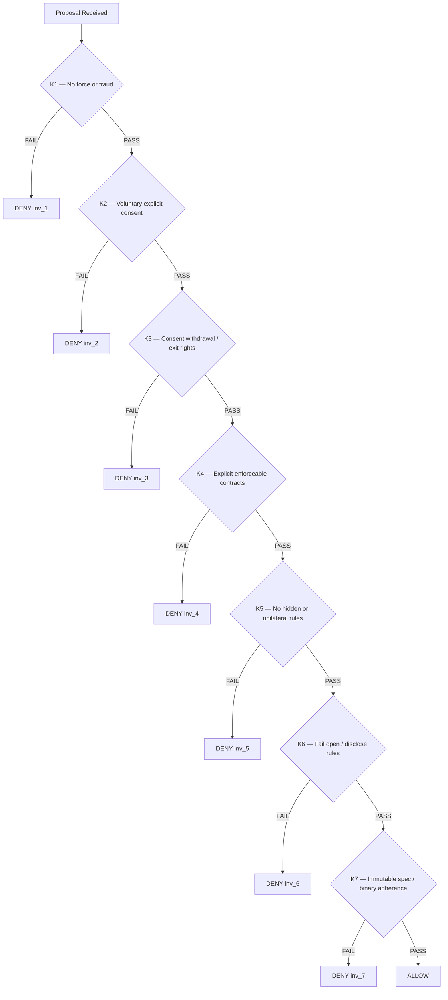
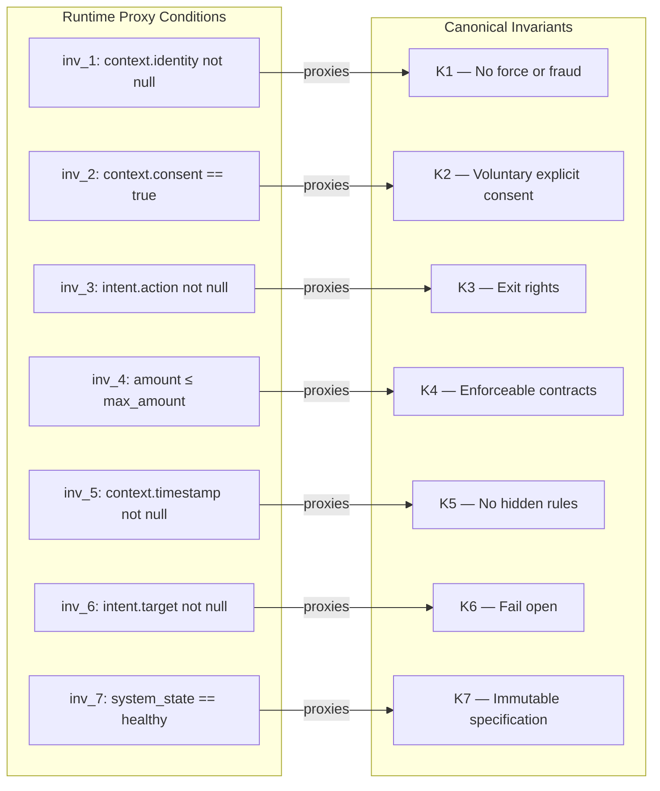
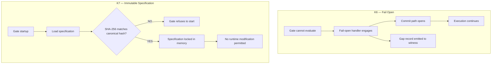
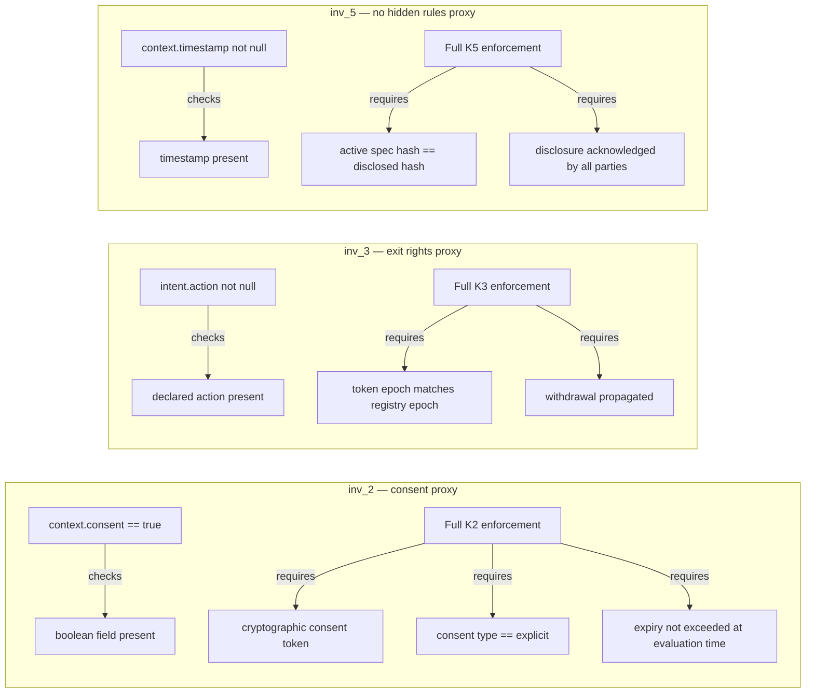
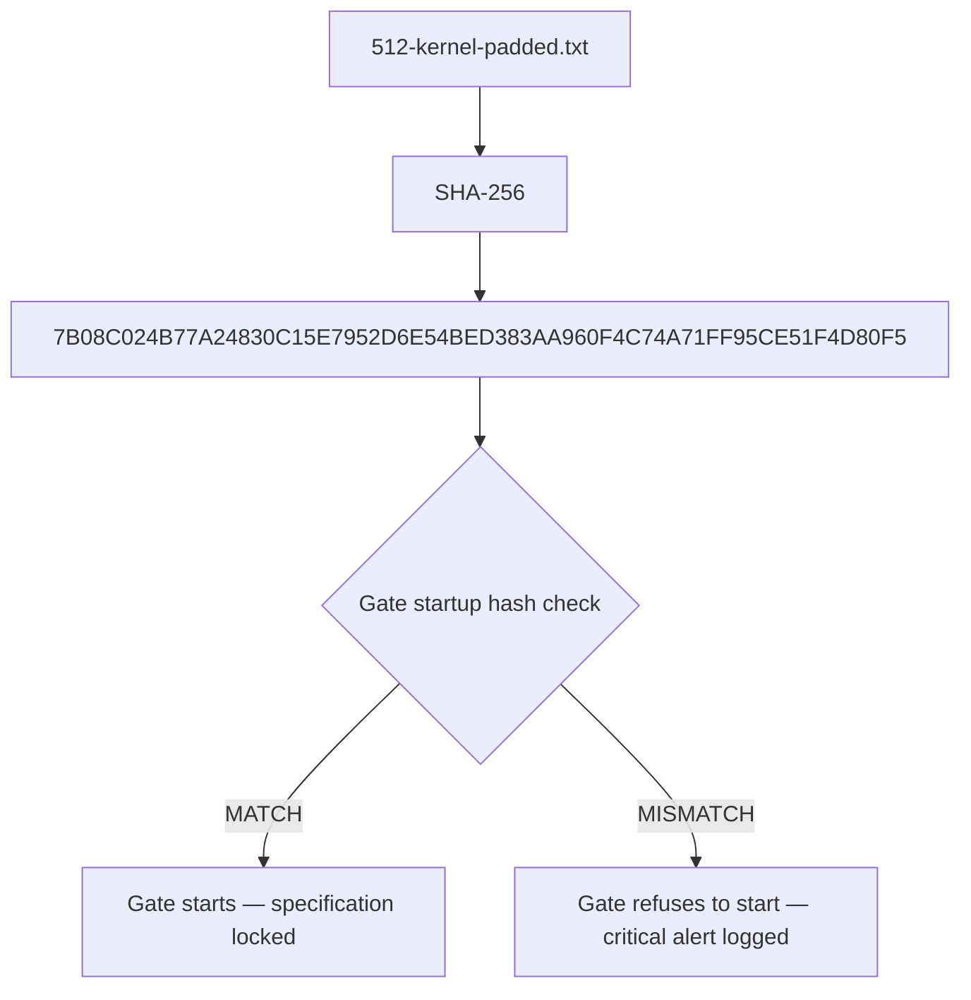

# Invariant Diagrams

## K1–K7 Canonical Invariants — Evaluation Order

---

## Runtime Proxy Mapping — inv_1 through inv_7

---

## K6 and K7 — Gate-Behaviour Invariants

K6 and K7 are not per-request field checks. They constrain gate
implementation. The proxy conditions in the reference runtime are
placeholders only.

---

## Proxy Completeness — What Each Proxy Enforces vs What Full Enforcement Requires

---

## Canonical Kernel Commitment

