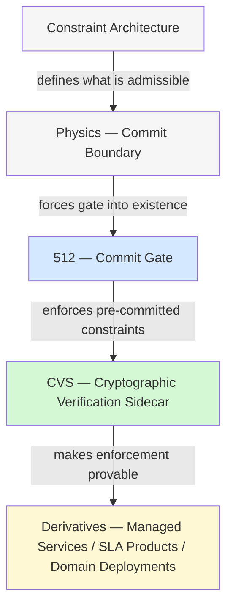
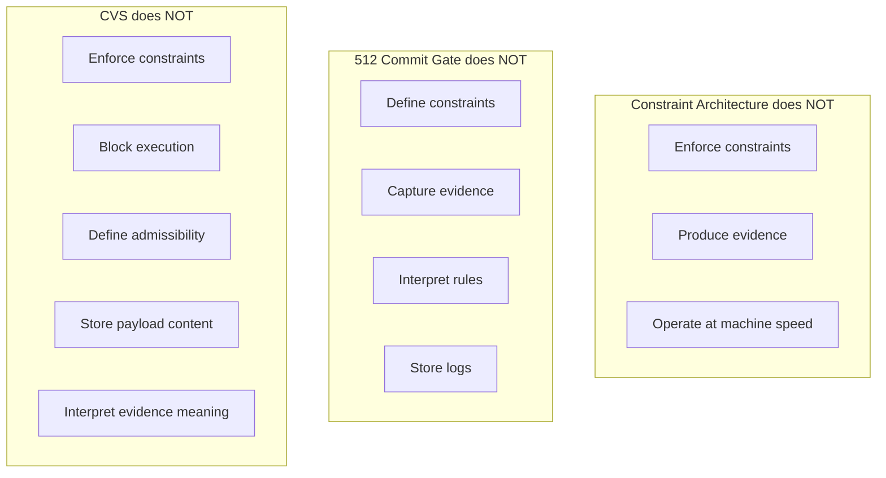
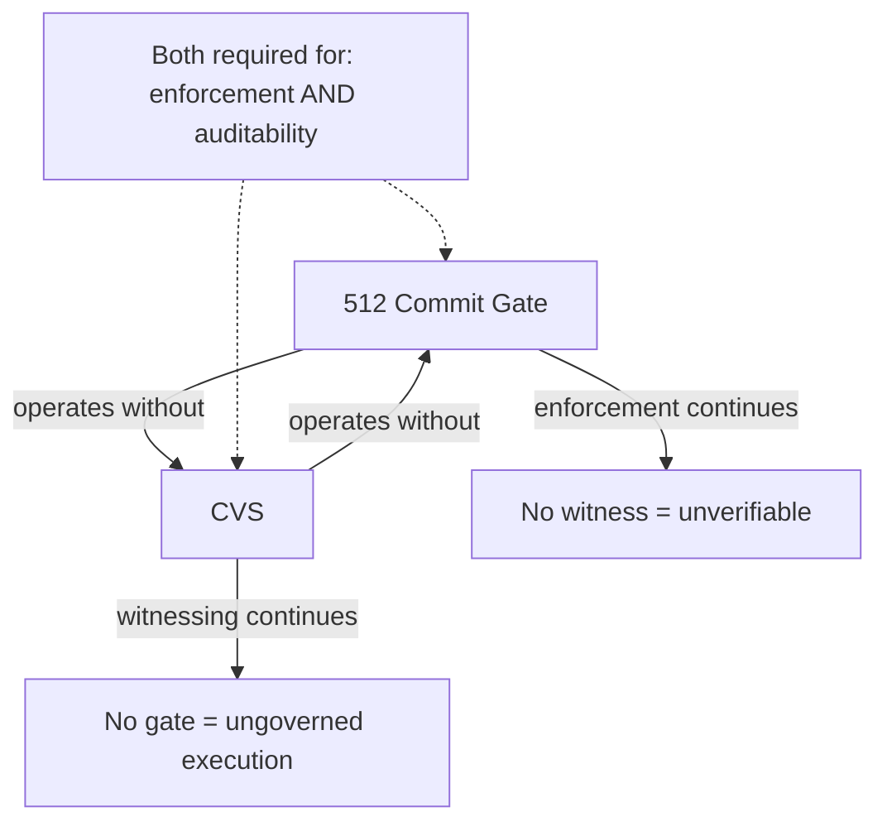
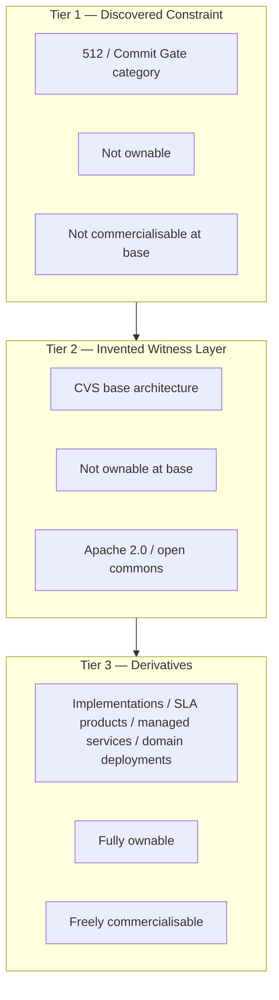
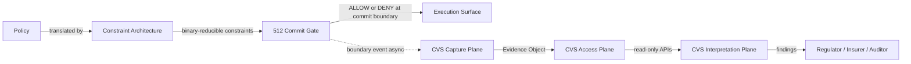

# Architectural Layer Diagrams

## The 512 / CVS Layer Stack

---

## Layer Responsibilities

```mermaid
flowchart LR
    subgraph CA ["Constraint Architecture"]
        A1[Consent logic]
        A2[Authority models]
        A3[Thresholds]
        A4[Domain constraints]
        A5[Admissibility rules]
    end

    subgraph Gate ["512 Commit Gate"]
        B1[Evaluates constraints]
        B2[Produces ALLOW or DENY]
        B3[Enforces at commit boundary]
        B4[Operates at sub-50μs]
        B5[Immutable specification]
    end

    subgraph Witness ["CVS Witness Layer"]
        C1[Observes gate decisions]
        C2[Constructs Evidence Objects]
        C3[Hash chains events]
        C4[Anchors to settlement ledger]
        C5[Enables independent verification]
    end

    CA -->|upstream definition| Gate
    Gate -->|boundary events| Witness
```

---

## What Each Layer Does Not Do

---

## Layer Independence

---

## Open Commons Model

---

## Deployment Sequence — Constraint to Evidence

