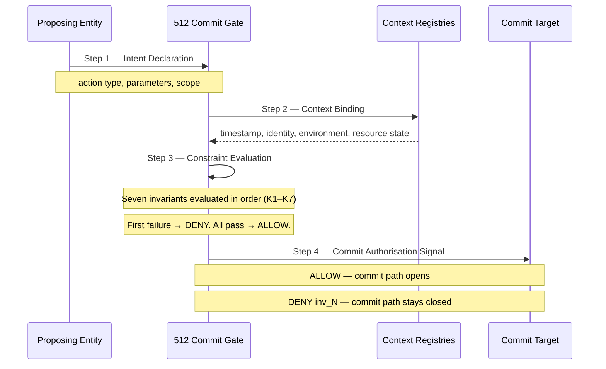
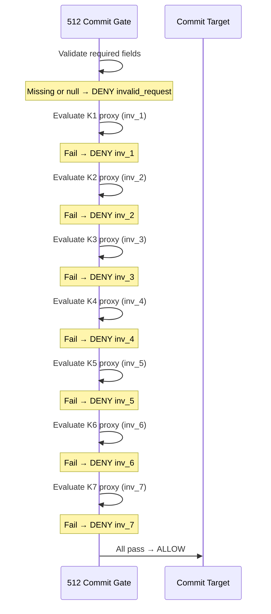
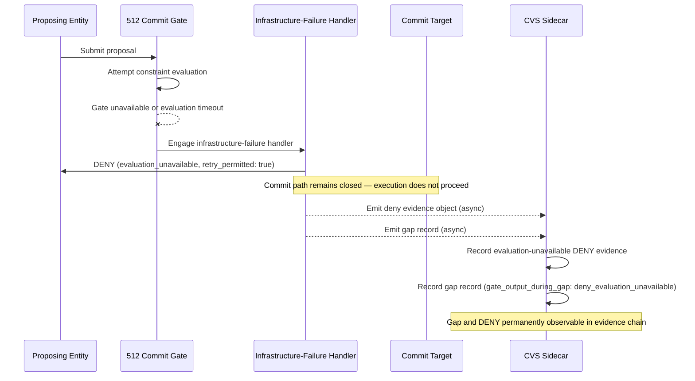

# Sequence Diagrams

## The Four-Step Validation Sequence



---

## Early-Exit Evaluation Flow



---

## Evaluation-Unavailable DENY — Gate Cannot Evaluate


---

## Proposal to Evidence — Full Path

```mermaid
sequenceDiagram
    participant P as Proposing Entity
    participant G as 512 Commit Gate
    participant C as Commit Target
    participant W as CVS Witness
    participant M as Merkle Batcher
    participant A as Settlement Layer

    P->>G: Submit proposal
    G->>G: Evaluate K1–K7
    G->>C: ALLOW or DENY inv_N
    G-->>W: Emit witness event (async)
    W->>W: Construct Evidence Object
    W->>W: Calculate evidence_hash
    W->>W: Sign witness_attestation via HSM
    W->>M: Emit merkle_leaf_hash
    M->>M: Batch leaves — build Merkle root
    M->>A: Anchor Merkle root
    A-->>M: Anchor receipt + ledger timestamp
    Note over A: Timestamp set by ledger — not operator
    Note over W,A: Evidence anchored within 30–60 seconds
