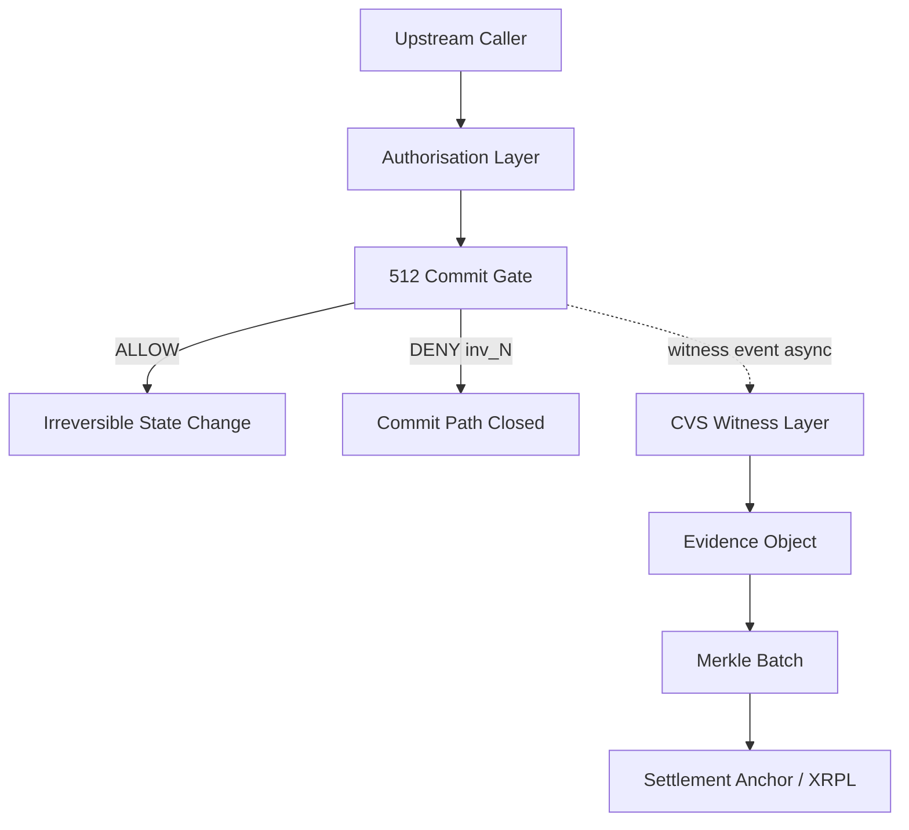
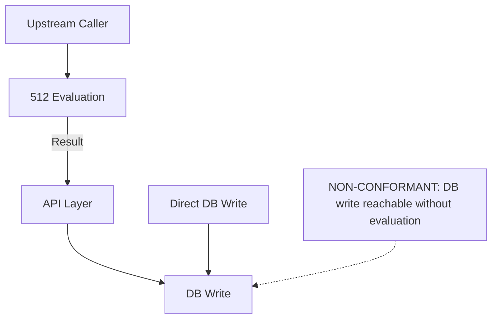
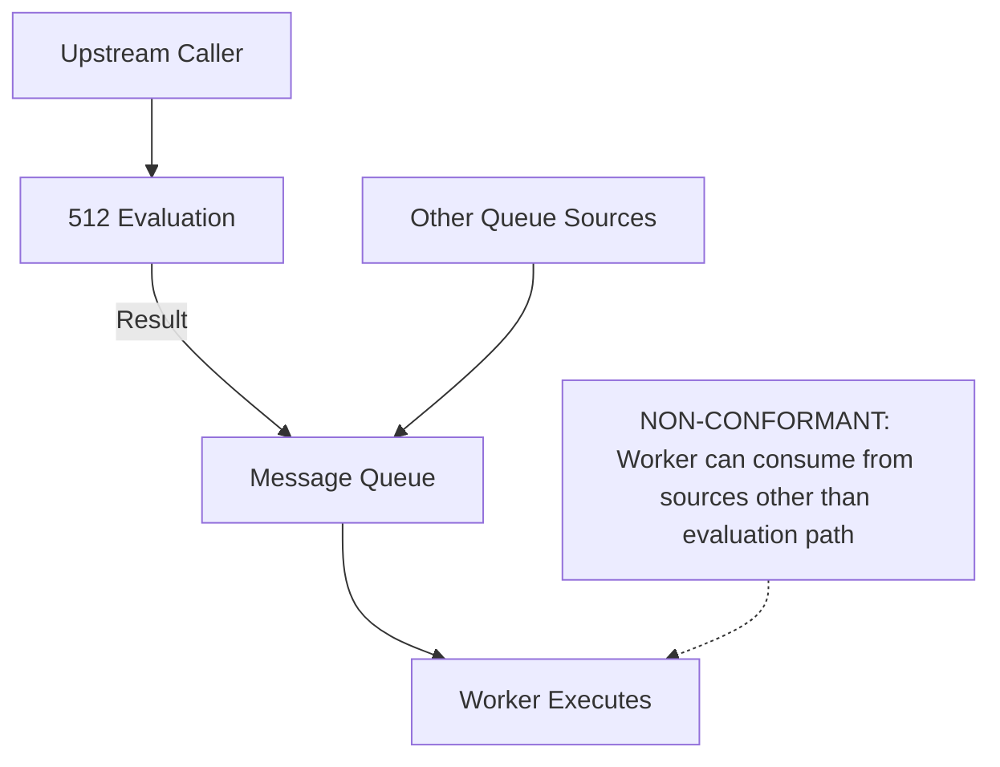
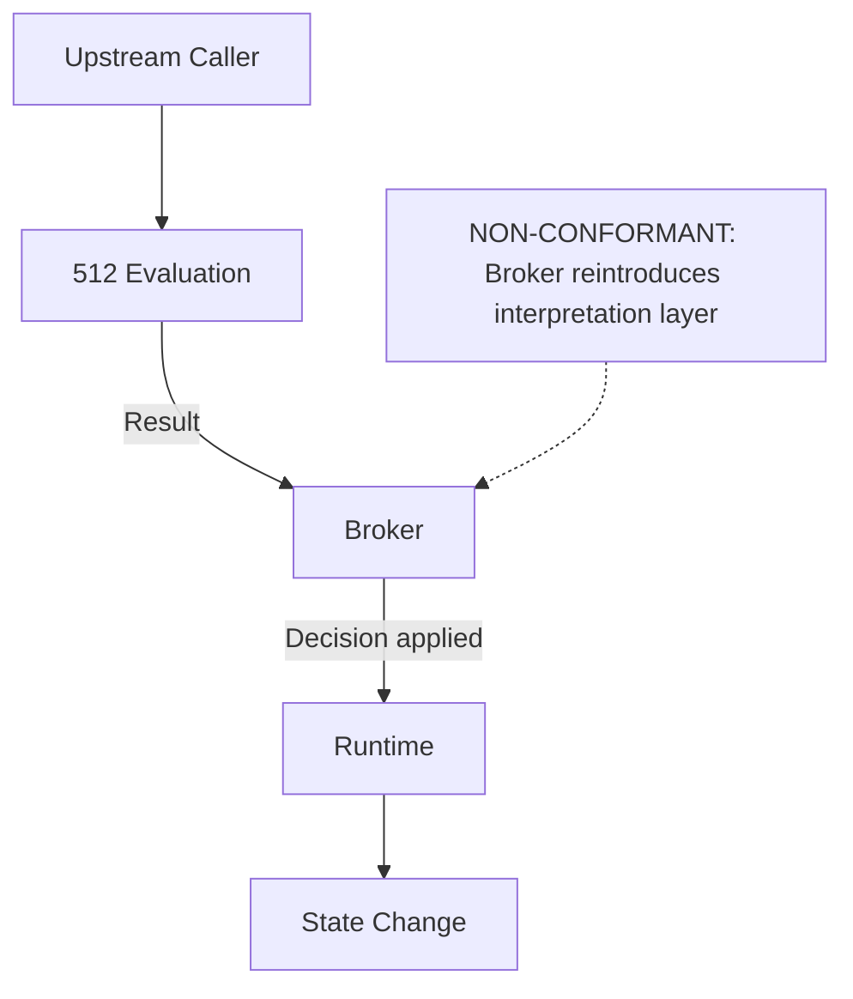
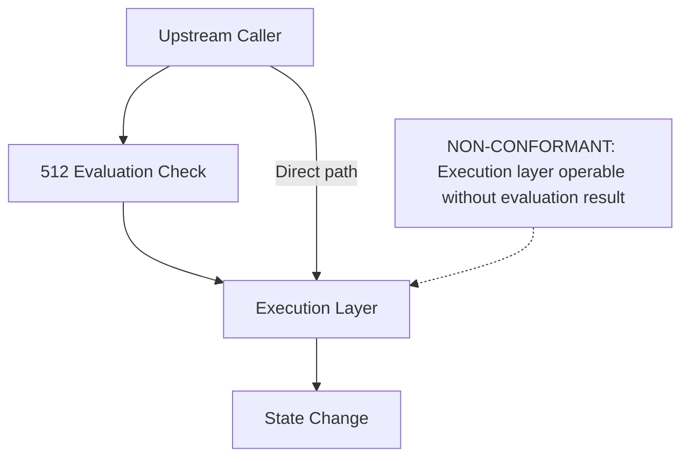
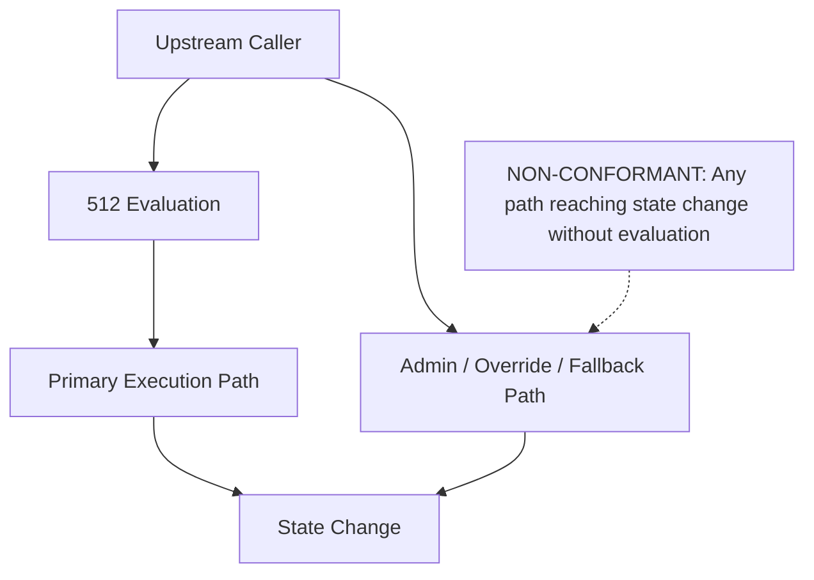
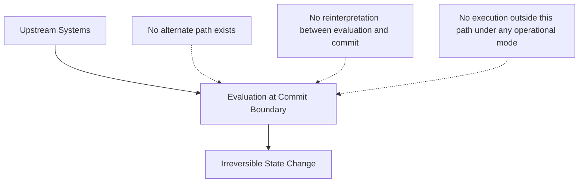

# Topology Diagrams

## Conformant Commit Gate Position

---

## Non-Conformant Pattern A — API Handoff

---

## Non-Conformant Pattern B — Queue Handoff

---

## Non-Conformant Pattern C — Broker Handoff

---

## Non-Conformant Pattern D — Pre-Check Positioning

---

## Non-Conformant Pattern E — Parallel Execution Path

---

## Conformant Model — Structural Summary

